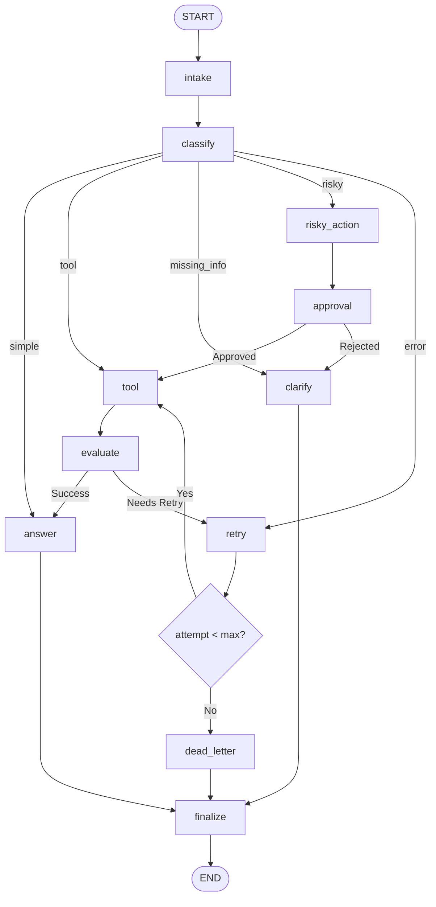

# Hướng Dẫn Chạy & Tổng Quan Dự Án - Lab LangGraph Day 08

Dự án này triển khai một đồ thị trạng thái (StateGraph) hoàn chỉnh bằng **LangGraph** để xử lý các yêu cầu hỗ trợ khách hàng (Support Ticket System). Hệ thống tích hợp đầy đủ tính năng phân loại thông minh bằng LLM, vòng lặp tự động thử lại lỗi (retry loops), phê duyệt có sự can thiệp của con người (Human-in-the-Loop - HITL), lưu trữ bền vững (Persistence) bằng SQLite và tự động tạo báo cáo chất lượng.

---

## 📊 Sơ Đồ Kiến Trúc Đồ Thị (StateGraph Architecture)

Dưới đây là kiến trúc luồng đi của đồ thị trạng thái:



---

## 🛠️ Hướng Dẫn Thiết Lập Môi Trường (Setup)

Dự án yêu cầu cài đặt môi trường ảo Python trên ổ D (hoặc thư mục dự án) để đảm bảo không ghi tệp rác lên ổ C:

### Bước 1: Khởi tạo môi trường ảo `venv`
Mở PowerShell tại thư mục dự án và chạy:
```powershell
python -m venv .venv
```

### Bước 2: Kích hoạt môi trường ảo
* **PowerShell (Windows):**
  ```powershell
  .\.venv\Scripts\Activate.ps1
  ```
* **Command Prompt (Windows):**
  ```cmd
  .\.venv\Scripts\activate.bat
  ```

### Bước 3: Cài đặt các thư viện phụ thuộc
Nâng cấp `pip` và cài đặt dự án kèm các thư viện hỗ trợ OpenRouter và SQLite Checkpointer:
```powershell
python -m pip install --upgrade pip
pip install -e ".[dev,google,openai,sqlite]"
pip install langgraph-checkpoint-sqlite
```

---

## ⚙️ Cấu Hình Biến Môi Trường (`.env`)

Tạo tệp `.env` tại thư mục gốc của dự án. Để sử dụng **OpenRouter** với model `gpt-oss-20b`, hãy thiết lập như sau:

```env
# 1. OpenRouter API Key
OPENAI_API_KEY=sk-or-v1-YOUR_OPENROUTER_API_KEY_HERE

# 2. Redirect Endpoint sang OpenRouter (Tương thích chuẩn OpenAI)
OPENAI_API_BASE=https://openrouter.ai/api/v1
OPENAI_BASE_URL=https://openrouter.ai/api/v1

# 3. Model ID trên OpenRouter
LLM_MODEL=gpt-oss-20b

# 4. Kích hoạt tạm ngắt duyệt thủ công (HITL) khi chạy tương tác
LANGGRAPH_INTERRUPT=true

# 5. Kích hoạt bộ lưu checkpoint SQLite bền vững
CHECKPOINTER=sqlite
```

---

## 🚀 Hướng Dẫn Chạy & Kiểm Thử

Hệ thống cung cấp các lệnh chạy nhanh thông qua `make` hoặc gọi trực tiếp qua môi trường ảo:

### 1. Chạy toàn bộ các bài Unit Tests
Chạy bộ kiểm tra tự động bao gồm kiểm tra cấu trúc State, định tuyến và kiểm thử khói đồ thị (gọi API thực tế):
```powershell
# Chạy toàn bộ test
.\.venv\Scripts\pytest

# Chạy cụ thể một file test với log chi tiết
.\.venv\Scripts\pytest -s -vv tests/test_graph_smoke.py
```

### 2. Chạy Kịch Bản Scenarios & Sinh Báo Cáo
Chạy 7 kịch bản kiểm tra mẫu tự động (từ file `data/sample/scenarios.jsonl`). Lệnh này sẽ:
1. Thực hiện chạy lần lượt các kịch bản.
2. Ghi kết quả đo lường chi tiết vào `outputs/metrics.json`.
3. **Tự động biên soạn báo cáo kỹ thuật** chất lượng cao và ghi đè vào `reports/lab_report.md`.

```powershell
# Lệnh make:
make run-scenarios

# Hoặc chạy trực tiếp:
.\.venv\Scripts\python.exe -m langgraph_agent_lab.cli run-scenarios --config configs/lab.yaml --output outputs/metrics.json
```

### 3. Xác thực kết quả chấm điểm (Validate Metrics)
Kiểm tra xem file `metrics.json` có cấu trúc hợp lệ và đạt tỷ lệ thành công đúng yêu cầu hay không:
```powershell
# Lệnh make:
make grade-local

# Hoặc chạy trực tiếp:
.\.venv\Scripts\python.exe -m langgraph_agent_lab.cli validate-metrics --metrics outputs/metrics.json
```

### 4. Kiểm tra chất lượng Code (Ruff Linter & Mypy)
Đảm bảo code không chứa cảnh báo linter và đạt chuẩn kiểu dữ liệu (Mypy type safety):
```powershell
# Lệnh make:
make lint
make typecheck

# Hoặc chạy trực tiếp:
.\.venv\Scripts\ruff check src
.\.venv\Scripts\mypy src
```

---

## 📁 Cấu Trúc Dự Án Chính

* `src/langgraph_agent_lab/`
  * `state.py`: Định nghĩa `AgentState` (dữ liệu truyền tải, quản lý reducer append/overwrite).
  * `nodes.py`: Triển khai 11 node xử lý logic (bao gồm các truy vấn LLM, mock tool, HITL...).
  * `routing.py`: Logic rẽ nhánh điều kiện cho đồ thị.
  * `graph.py`: Đăng ký node và wiring kết nối đồ thị.
  * `persistence.py`: Khởi tạo `SqliteSaver` checkpointer lưu trữ checkpoint xuống đĩa cứng.
  * `report.py`: Render tự động dữ liệu metrics thành tệp báo cáo markdown `reports/lab_report.md`.
* `reports/`
  * `lab_report.md`: Báo cáo kỹ thuật sinh ra sau khi chạy scenarios (chứa kết quả chạy, phân tích lỗi và mô tả kiến trúc).
* `outputs/`
  * `metrics.json`: Tệp chứa kết quả đo lường chi tiết của các scenarios.
